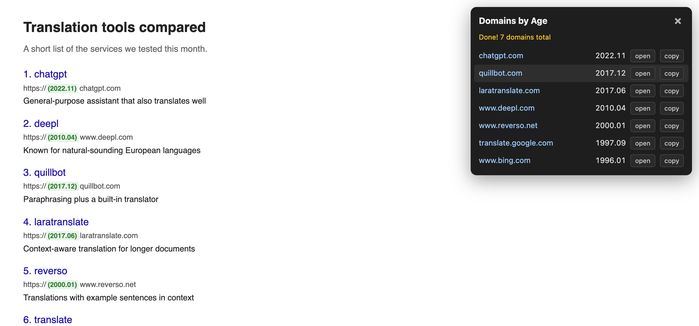

# Domains by Age

一个 Chrome 扩展：**一键找出当前网页上出现的所有域名，查出每个域名的注册时间，并按从新到旧排列。**

适合用来快速判断一个页面里哪些网站是「新站」、哪些是「老站」——比如看搜索结果、竞品列表、导航站、论坛帖子、SEO 工具的报表时。



[English](#english)

---

## 功能

- **一键扫描**：点工具栏上的图标，自动识别页面文字里的所有域名（包括链接文字、网址、正文里提到的域名）。
- **查注册时间**：逐个查询 whois，显示注册年月（如 `2022.11`）。
- **按新旧排序**：右上角弹出面板，最新注册的排在最上面，查不到的放在最后。
- **页面内标注**：扫描完成后，页面上每个域名前面会加一个绿色的 `(年.月)` 标签，不用切换视线就能看出新旧。
- **open**：在后台新标签页打开这个网站，当前页面不跳走，方便一个个点开看。
- **copy**：把域名复制到剪贴板，按钮变成 ✓ 表示成功。
- **定位**：点列表里某一行（按钮以外的地方），页面会滚动到这个域名出现的位置并闪一下高亮。
- **有缓存**：查过的域名会记住，下次在任何网站上遇到都直接显示，不再重复查询。

## 安装

这个扩展没有上架 Chrome 应用商店，需要用「开发者模式」手动加载，大约 1 分钟：

1. **下载代码**：在本页面点绿色的 `Code` 按钮 → `Download ZIP`，然后解压。
   （会用 git 的话也可以：`git clone https://github.com/alexsu1212/domains-by-age.git`）
2. 在 Chrome 地址栏输入 `chrome://extensions` 并回车。
3. 打开右上角的 **开发者模式** 开关。
4. 点左上角 **加载已解压的扩展程序**，选择刚才解压出来的文件夹（里面能看到 `manifest.json` 的那一层）。
5. 点浏览器右上角的拼图图标 🧩，找到 **Domains by Age**，点图钉把它固定到工具栏。

> 解压出来的文件夹不要删除或移动，Chrome 是直接从这个文件夹运行扩展的。

Edge、Brave、Arc 等基于 Chromium 的浏览器也可以用同样的方法安装。

## 使用

1. 打开任意网页。
2. 点工具栏上的 **Domains by Age** 图标。
3. 右上角出现面板，显示 `Checked x/y` 进度，查完后显示 `Done! N domains total`；页面上没有域名时显示 `No domains found on this page`。
4. 看完了点面板右上角的 **×**，或者再点一次图标关闭面板；关闭后再点一次图标会重新扫描。

### 面板里每一列是什么

| 列 | 说明 |
| --- | --- |
| 域名 | 页面上出现的域名，原样显示（如 `www.deepl.com`） |
| 年月 | 注册时间，格式 `年.月`；显示 `—` 表示没查到 |
| open | 在后台新标签页打开 `https://域名` |
| copy | 复制域名 |

## 识别规则

- **子域名按主域名查询**：`www.deepl.com`、`translate.google.com` 这类会分别查 `deepl.com`、`google.com` 的注册时间。`co.uk`、`com.cn`、`com.au` 这类二级后缀也能正确处理。
- **支持的后缀**：`com` `net` `org` `me` `xyz` `im` `info` `io` `co` `ai` `biz` `us` `app` `sg` `cafe` `now` `shop` `life` `cn` `uk` `chat` `design` `fun` `website` `link` `site` `online` `cards` `fr` `sk` `it` `new` `video` `tw` `jp` `dev` `tools` `pro` `vip` `top` `cc` `box`。
  想加别的后缀，编辑 `content.js` 顶部的 `SUFFIXES` 列表，然后在 `chrome://extensions` 里点扩展卡片上的刷新按钮。
- **会跳过的内容**：
  - 邮箱地址（`name@outlook.com` 里的 `outlook.com` 不算网站）
  - 输入框、可编辑区域里的文字
  - 页面代码（脚本、样式）里的文字
- **注意**：页面上隐藏的文字（比如收起来的下拉菜单）也会被扫描到。

## 常见问题

**为什么有些域名显示 `—`？**
查询接口没有返回注册时间。常见原因：部分国家/地区后缀（如 `.co.uk`）的 whois 信息不公开、域名本身没注册、网络超时。查询失败只会缓存 10 分钟，之后再扫描会重新查。

**点图标没有反应？**
- Chrome 不允许扩展在 `chrome://` 开头的页面、Chrome 应用商店页面上运行，这是浏览器限制。
- 刚安装或刚更新扩展后，已经打开的网页需要先刷新一次。

**页面上的绿色日期标签怎么去掉？**
刷新页面即可。扩展不会修改网站本身，只改动你当前看到的这一份页面。

**查询很慢？**
第一次查询每个域名都要联网，同时最多查 5 个。查过的域名会缓存 180 天，之后几乎是秒出。

## 隐私与权限

- **只在你点图标时运行**：扩展不会在后台自动读取你浏览的网页。
- **发出去的只有主域名**：页面内容只在你的浏览器里分析。对外只发送主域名（如 `deepl.com`），发到第三方 whois 查询接口 `whois.freeaiapi.xyz`。不会上传网址路径、页面内容或任何个人信息。
- **缓存保存在本地**：查询结果存在浏览器的扩展存储里，不会同步到任何服务器。卸载扩展即全部清除。

扩展申请的权限：

| 权限 | 用途 |
| --- | --- |
| `activeTab` | 在你点图标的那个标签页里运行扫描 |
| `scripting` | 把扫描脚本注入到当前页面 |
| `storage` | 在本地缓存查询结果 |
| `clipboardWrite` | copy 按钮复制域名 |
| `https://whois.freeaiapi.xyz/*` | 查询域名注册时间 |

## 文件结构

```
manifest.json     扩展配置
background.js     后台：whois 查询、缓存、打开新标签页
content.js        页面脚本：识别域名、显示面板、页面标注
icons/            图标
docs/             说明文档用的截图
```

---

## English

**Domains by Age** is a Chrome extension that finds every domain mentioned on the current page, looks up when each one was registered, and lists them newest first. It's a quick way to tell new sites from established ones in search results, competitor lists, directories, or SEO reports.

**Features**
- One click scans all domains in the page text.
- Shows the registration month (`YYYY.MM`) for each domain, sorted newest first.
- After the scan, adds a green `(YYYY.MM)` label next to each domain on the page.
- **open** opens the site in a background tab. **copy** copies the domain.
- Click a row to scroll to where that domain appears on the page.
- Caches results locally, so domains you've already looked up show up instantly on any site.

**Install**
1. Download this repo (`Code` → `Download ZIP`) and unzip it.
2. Go to `chrome://extensions` and turn on **Developer mode**.
3. Click **Load unpacked** and select the unzipped folder (the one containing `manifest.json`).
4. Pin **Domains by Age** to the toolbar from the puzzle-piece menu.

**Privacy**
The extension runs only when you click its icon. Page content is analyzed locally. The only data sent out is each registrable domain name (e.g. `deepl.com`), which goes to the third-party whois API at `whois.freeaiapi.xyz`. Results are cached in local extension storage.

Subdomains are looked up by their registrable domain (`www.deepl.com` → `deepl.com`). Email addresses, input fields, and script/style content are skipped. To support more TLDs, edit the `SUFFIXES` list at the top of `content.js`.
